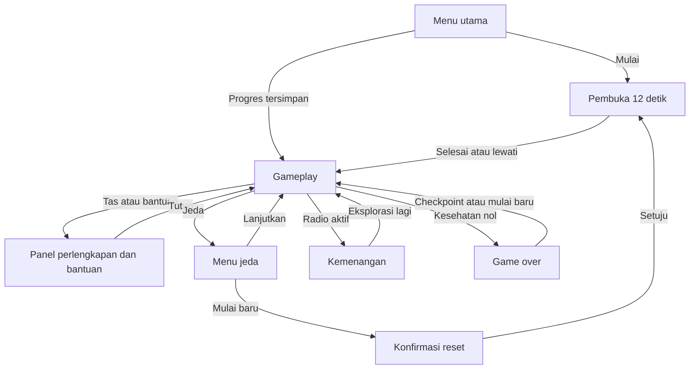
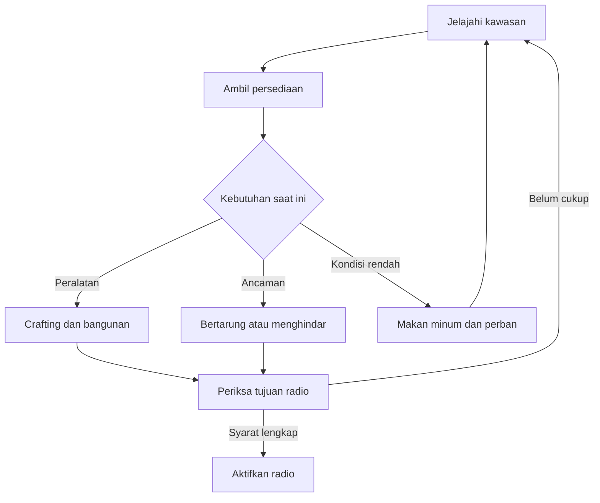
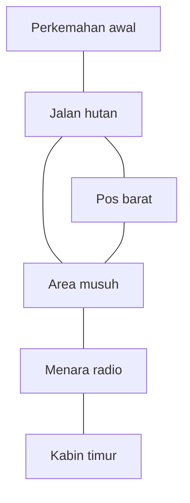

# Fading Dawn: Sinyal Terakhir

## Perancangan dan Pengembangan Prototipe Game Survival 3D “Fading Dawn” Berbasis WebGL untuk Eksplorasi dan Pengelolaan Sumber Daya

**Laporan Mata Kuliah STI7356 — Pengembangan Game**

> **Status versi 0.1:** kode prototipe tersedia, pemeriksaan sumber dan 12 pengujian logika lulus. Playtest browser, pengukuran performa, dan screenshot hasil permainan belum dilakukan. Bagian hasil membedakan implementasi pada kode dari hasil pengujian pemain. Dokumen mengikuti struktur `Template_Laporan_STI7356_Pengembangan_Game(1).pdf`; contoh 2D disesuaikan dengan proyek 3D. Identitas mahasiswa belum diberikan.

| Identitas | Keterangan |
|---|---|
| Nama mahasiswa / anggota tim | **[Isi nama lengkap mahasiswa / anggota tim]** |
| NIM | **[Isi NIM setiap anggota]** |
| Kelas | **[Isi kelas]** |
| Dosen pengampu | **[Isi nama dosen pengampu]** |
| Program studi / institusi | **[Isi sesuai identitas peserta mata kuliah]** |
| Semester / tahun akademik | **[Isi semester dan tahun akademik]** |
| Nama game | Fading Dawn: Sinyal Terakhir |
| Genre | Survival, action-adventure |
| Engine / tools | Renderer WebGL khusus, JavaScript ES Modules, HTML, CSS, Web Audio API, GitHub |
| Repositori | [NourAnisa/fading-dawn](https://github.com/NourAnisa/fading-dawn) |

### Menjalankan proyek

Game memakai aset geometri dan audio sintetis dari kode, tanpa unduhan library atau aset pihak ketiga saat dimainkan. Jalankan dari server HTTP agar ES Modules dapat dimuat.

```bash
git clone https://github.com/NourAnisa/fading-dawn.git
cd fading-dawn
python3 -m http.server 8080 --directory docs
```

Buka [game lokal](http://localhost:8080). Di Windows, perintah server dapat menggunakan `py -m http.server 8080 --directory docs`. Python hanya diperlukan untuk server pengembangan. Versi publik memakai GitHub Pages.

**Publikasi GitHub Pages:** buka [Settings → Pages](https://github.com/NourAnisa/fading-dawn/settings/pages), pilih **Source: GitHub Actions**, lalu jalankan ulang workflow **Validate and deploy game** dari [Actions](https://github.com/NourAnisa/fading-dawn/actions). Alamat tujuan publikasi adalah `https://nouranisa.github.io/fading-dawn/`; alamat ini baru dapat digunakan setelah deployment berstatus sukses.

| Kontrol | Fungsi |
|---|---|
| W A S D / tombol panah | Bergerak |
| Mouse / geser layar sentuh | Mengarahkan kamera |
| Shift kiri | Berlari |
| Klik kiri / Spasi | Menembak atau memasang bangunan |
| R / F | Isi ulang / serangan jarak dekat |
| E | Mengambil item atau mengaktifkan radio |
| I | Inventory, crafting, makan, minum, perban |
| B | Masuk / keluar mode bangun |
| 1 / 2 / 3 | Fondasi / dinding / pintu |
| Q | Memutar bangunan |
| P / Escape | Jeda |
| Tombol pada layar | Alternatif kontrol sentuh |

Klik dunia permainan untuk mengunci mouse. Jika penguncian tidak didukung, arahkan kamera dengan menyeret mouse dan gunakan Spasi untuk menembak. Panel jeda menyediakan pengaturan musik dan efek suara.

**Target misi:** pasang satu fondasi, satu dinding, dan satu pintu; kalahkan sedikitnya tiga musuh; bawa lima komponen dan empat batu ke menara radio. Pintu berupa bukaan yang dapat dilalui. Ini merupakan demonstrasi sistem bangunan sederhana, bukan simulasi rumah atau pertahanan markas lengkap.

### Daftar isi

- [Abstrak](#abstrak)
- [Bab I. Pendahuluan](#bab-i-pendahuluan)
- [Bab II. Tinjauan Pustaka](#bab-ii-tinjauan-pustaka)
- [Bab III. Metode dan Proses Perancangan Game](#bab-iii-metode-dan-proses-perancangan-game)
- [Bab IV. Hasil dan Pembahasan](#bab-iv-hasil-dan-pembahasan)
- [Bab V. Penutup](#bab-v-penutup)
- [Daftar Pustaka](#daftar-pustaka)
- [Lampiran](#lampiran)

## ABSTRAK

Pengembangan game survival melibatkan integrasi navigasi, pengelolaan sumber daya, pertarungan, dan penyajian informasi yang harus dipahami pemain secara bersamaan. Proyek ini bertujuan merancang dan mengembangkan prototipe Fading Dawn: Sinyal Terakhir sebagai penerapan materi mata kuliah Pengembangan Game melalui pengalaman bertahan hidup di kawasan hutan terbengkalai. Pengembangan menggunakan pendekatan prototyping iteratif yang mencakup perancangan konsep, penyusunan alur permainan, implementasi, serta pengujian logika. Game dirancang sebagai permainan tiga dimensi untuk satu pemain pada browser dengan renderer WebGL khusus, JavaScript, HTML, CSS, dan Web Audio API. Mekanisme inti meliputi eksplorasi, pengambilan bahan, crafting, pemasangan bangunan, pertarungan, dan pemulihan menara radio sebagai tujuan akhir. Implementasi kode mencakup satu kawasan dengan tiga tahap tantangan, delapan musuh, pembuka singkat, antarmuka status pemain, audio sintetis, serta penyimpanan progres lokal. Pemeriksaan sintaks dan keterhubungan berkas berhasil, sedangkan dua belas pengujian unit dan integrasi logika dinyatakan lulus. Pengujian tersebut belum membuktikan kualitas tampilan, kenyamanan kontrol, performa perangkat, maupun keberhasilan permainan menyeluruh pada browser. Prototipe ini menyediakan dasar pengembangan lanjutan dan dokumentasi evaluasi yang dapat diperbarui setelah playtest dilakukan.

**Kata kunci:** game survival; WebGL; prototyping; pengelolaan sumber daya; game browser.

## BAB I. PENDAHULUAN

### 1.1 Latar Belakang

Game digital merupakan produk interaktif yang menggabungkan aturan, keputusan pemain, presentasi visual, dan umpan balik. Penyajian informasi menjadi penting ketika pemain harus membaca keadaan sekaligus bertindak. Rujukan desain antarmuka Galitz dan Fox menempatkan perancangan tampilan sebagai bagian yang perlu dipertimbangkan dalam pengembangan sistem interaktif dan antarmuka game [1], [2]. Dalam proyek ini, hubungan tersebut dipelajari melalui genre survival.

Inspirasi awal Fading Dawn berasal dari pengalaman survival yang diinginkan pengguna pada Once Human dan LifeAfter: menjelajahi wilayah, mengumpulkan bahan, membuat perlengkapan, dan bertahan dari ancaman. Skala produksi AAA tidak menjadi ukuran pencapaian tugas ini. Pengembangan dibatasi pada prototipe kecil agar hubungan antarmekanik dapat diimplementasikan dan dievaluasi secara bertahap. Pendekatan yang berpusat pada pengalaman bermain menekankan prototyping, playtesting, dan revisi desain [3].

Masalah yang ingin dijawab dalam lingkup proyek adalah bagaimana menyatukan mekanik tersebut menjadi satu alur yang dapat dipahami, diselesaikan, dan dibagikan melalui repositori. Tantangan teknisnya meliputi pengendalian karakter, transaksi inventory yang konsisten, penempatan bangunan, serta pemberian informasi tujuan kepada pemain. Masalah ini merupakan kebutuhan pengembangan proyek, bukan hasil survei yang menyatakan adanya kekurangan seluruh game di pasar.

Solusi yang dirancang adalah Fading Dawn: Sinyal Terakhir, game survival 3D bergaya low-poly dengan satu kawasan dan tujuan memulihkan radio. JavaScript dan WebGL digunakan agar artefak dapat disajikan sebagai berkas web statis. GitHub Pages mendukung publikasi HTML, CSS, dan JavaScript dari repositori [4]. Angka pasar industri tidak dicantumkan karena laporan ini belum mengumpulkan sumber statistik yang sesuai untuk analisis tersebut.

### 1.2 Rumusan Masalah

1. Bagaimana merancang alur navigasi dan tahapan tantangan yang menghubungkan eksplorasi, crafting, pembangunan, dan pertarungan?
2. Bagaimana merancang karakter, properti, serta lingkungan 3D yang mendukung tema survival dan keterbacaan objek?
3. Bagaimana mengimplementasikan storyline, storyboard, UI/UX, menu, opening, dan audio dalam prototipe browser?
4. Bagaimana memverifikasi logika prototipe dan menyiapkan pengujian gameplay serta distribusinya melalui GitHub Pages?

### 1.3 Tujuan

1. Merancang satu alur permainan dengan tiga tahap tantangan dan kondisi kemenangan yang terukur.
2. Mengimplementasikan karakter pemain, musuh, sumber daya, dan tiga jenis bangunan menggunakan geometri sederhana.
3. Mengimplementasikan pembuka, antarmuka, menu, audio, serta narasi yang mendukung tujuan permainan.
4. Menjalankan pengujian logika, menyusun skenario playtest, dan menyediakan konfigurasi publikasi GitHub Pages.

### 1.4 Manfaat

**Teoretis:** menjadi contoh penerapan hubungan aturan, tujuan, antarmuka, dan alur permainan dalam prototipe survival. **Bagi pemain:** menyediakan pengalaman eksplorasi dan pengambilan keputusan terkait persediaan. **Bagi pengembang:** melatih perancangan sistem, pemrograman grafis, pengujian, dan dokumentasi perubahan melalui GitHub. Manfaat pembelajaran atau peningkatan kemampuan pemain belum diukur melalui penelitian pengguna.

### 1.5 Batasan Masalah

- Format 3D low-poly; menggunakan WebGL khusus, bukan Unreal Engine atau Unity.
- Single-player dengan satu kawasan dan tiga tahap tujuan; tahap tersebut bukan tiga map terpisah.
- Tersedia delapan musuh sederhana, satu pistol, serangan jarak dekat, serta bangunan fondasi, dinding, dan pintu.
- Tidak mencakup multiplayer, backend, akun pemain, cloud save, kendaraan, ekonomi daring, atau kualitas produksi AAA.
- Progres disimpan pada browser/perangkat yang sama. Data dapat hilang jika penyimpanan situs dihapus.
- Animasi karakter bersifat prosedural sederhana; tidak menggunakan sprite sheet atau motion capture.
- Pengujian yang telah dilakukan adalah pemeriksaan sumber dan logika. Evaluasi visual, audio, dan UX pada pemain masih diperlukan.

## BAB II. TINJAUAN PUSTAKA

### 2.1 Definisi, Sejarah, dan Perkembangan Game

Fullerton membahas game melalui sistem formal, dramatis, dan dinamis serta proses desain yang berpusat pada pemain [3]. Salen dan Zimmerman mengkaji game sebagai sistem interaktif yang dapat dianalisis melalui aturan, pengalaman bermain, dan konteks budaya [5]. Kedua perspektif digunakan untuk memandang game sebagai hubungan antara tindakan, batasan, dan hasil; tampilan grafis saja belum cukup membentuk pengalaman permainan.

Permainan tradisional seperti catur dan congklak telah ada sebelum komputer. Transformasi ke permainan digital memindahkan sebagian pengelolaan aturan dan keadaan permainan ke perangkat lunak. Dalam Fading Dawn, prinsip tersebut terlihat pada persediaan yang dikurangi otomatis, deteksi tabrakan, dan pemeriksaan syarat kemenangan. Bagian sejarah ini merupakan ringkasan konseptual, bukan kronologi industri yang lengkap.

| Genre | Karakteristik | Contoh pembanding umum |
|---|---|---|
| Action | Ketepatan waktu dan respons gerak | Super Mario Bros. |
| Adventure | Eksplorasi dan penemuan tujuan | The Legend of Zelda |
| RPG | Perkembangan karakter dan peran | Final Fantasy |
| Puzzle | Pemecahan masalah berbasis aturan | Tetris |
| Simulation | Pengelolaan sistem yang disimulasikan | The Sims |
| Educational | Aktivitas bermain dengan tujuan belajar | Seri The Oregon Trail |
| Survival | Menjaga kondisi dan mengelola persediaan | Inspirasi proyek: Once Human dan LifeAfter |

Game dapat dibahas pula dalam konteks produksi independen, platform mobile, pembelajaran, kompetisi esports, dan pertemuan pengembang seperti GDC. Laporan ini tidak menyatakan besaran tren atau pangsa pasarnya. Fading Dawn memilih survival karena mekaniknya mempertemukan eksplorasi, konflik, dan keputusan sumber daya dalam satu prototipe.

### 2.2 Proses dan Metode Perancangan Game

Dokumen desain game atau GDD merangkum tujuan pengalaman, aturan, karakter, ruang bermain, aset, dan kebutuhan teknis. Siklus prototyping dan revisi digunakan untuk memeriksa apakah mekanik mendukung pengalaman yang dituju [3]. Dalam laporan ini, kegiatan dikelompokkan menjadi praproduksi, produksi, dan evaluasi/distribusi.

Model tugas dan diagram membantu menjelaskan hubungan tindakan pengguna dengan perpindahan keadaan antarmuka [6]. Prinsip navigasi juga membantu menyusun pilihan yang dapat dijangkau dan dipahami pengguna [7]. Penerapannya pada Fading Dawn adalah pemisahan menu, gameplay, tas, jeda, serta hasil permainan; diagram navigasinya disajikan pada Bab III.

### 2.3 Perancangan Karakter Game

Karakter pemain menjadi sarana melakukan tindakan, sedangkan NPC dan musuh menjalankan peran berdasarkan logika permainan. Desain karakter berkaitan dengan mekanik dan pengalaman yang ingin dibangun [8]. Fading Dawn menggunakan penyintas berpakaian hijau dengan tas cokelat serta musuh berwarna gelap dengan aksen merah.

Pada game 2D, sprite sheet menyimpan beberapa gambar animasi. Prototipe ini memakai bagian tubuh berbentuk balok dengan perubahan posisi sederhana untuk memberi kesan berjalan. Sketsa manual, ekspresi wajah rinci, rigging, dan animasi anatomis belum dibuat; proses tersebut tidak diklaim telah dilakukan.

### 2.4 Studi Properti dan Elemen Desain Game

Elemen formal menjelaskan pemain, tujuan, aturan, prosedur, sumber daya, konflik, batasan, dan hasil. Elemen dramatis memberi konteks melalui premis, karakter, dan cerita [3]. Pada Fading Dawn, bahan yang terbatas menjadi kendala formal, sedangkan terputusnya komunikasi menjadi alasan naratif untuk menjelajah.

Kayu, batu, komponen, ransum, air, perban, dan peluru mempunyai fungsi berbeda. Bentuk dan warna membantu membedakan objek. Lingkungan 3D menggunakan bidang tanah, balok bangunan, dan kerucut vegetasi; tilemap dan parallax 2D tidak digunakan. Tipografi sans-serif dan warna amber pada kontrol penting dipilih sebagai keputusan desain proyek.

### 2.5 Storyline dan Storyboard Game

Narasi game perlu berhubungan dengan tindakan pemain; rancangan pengalaman, aturan, dan cerita dapat ditinjau bersama [8]. Storyline menjelaskan kejadian, sedangkan storyboard memetakan adegan, pesan, aksi, dan transisi.

Berbeda dari urutan film yang tetap, perjalanan Fading Dawn dapat tertunda oleh eksplorasi, kembali ke tas, atau berakhir saat kesehatan habis. Storyboard pada Bab III mencakup cabang kemenangan dan kekalahan. Panel visual storyboard masih perlu dilengkapi; tabel adegan merupakan naskah perancangannya.

### 2.6 Desain User Interface dan User Experience Game

UI mencakup kontrol dan informasi yang terlihat. UX mencakup pengalaman menggunakan kontrol, memahami tujuan, dan menerima umpan balik. Rujukan Galitz dan Fox digunakan sebagai landasan pembahasan antarmuka [1], [2]. Penerapan kejelasan, konsistensi, dan prioritas informasi pada game ini merupakan keputusan desain yang perlu diuji dengan pemain.

HUD menampilkan kondisi, persediaan peluru, tujuan, arah, dan peta. Notifikasi muncul saat item diambil, bahan tidak mencukupi, atau aksi selesai. Tas dan jeda menghentikan simulasi. Keberadaan komponen ini belum membuktikan keterbacaan atau kepuasan pengguna; keduanya menjadi sasaran playtest.

### 2.7 Opening Movie, Menu, dan Sound Design

Opening memberi konteks sebelum pemain mengambil kendali. Dalam proyek ini bentuknya adegan pembuka berbasis engine selama 12 detik dengan tiga pesan narasi dan tombol lewati, bukan video prarender. Menu dibagi menurut tugas: memulai, melanjutkan, mengelola perlengkapan, menjeda, dan melihat bantuan.

Audio dibedakan menjadi musik latar, efek aksi, dan penanda hasil. Rujukan Cohen, Giangola, dan Balogh membahas voice user interface [9]; rujukan wajib ini dicatat sesuai template, tetapi prototipe tidak mengimplementasikan pengenalan suara atau kontrol suara. Audio aktual dihasilkan secara sintetis melalui Web Audio API setelah interaksi pemain, sesuai kebutuhan kebijakan autoplay browser [10].

### 2.8 Level Design dan Sistem Gameplay

Tantangan disusun bertahap agar pemain dapat mempelajari mekanik sebelum menggabungkannya [3], [8]. Tahap awal Fading Dawn memperkenalkan pengambilan bahan; tahap kedua mempertemukan crafting, pembangunan, dan pertarungan; tahap akhir meminta pemain memenuhi syarat radio.

Kemajuan diukur melalui jumlah jenis bangunan, musuh yang dikalahkan, dan status radio. Game tidak memakai skor numerik tunggal. Kesehatan nol memicu game over. Checkpoint menggunakan penyimpanan terakhir; memuat progres belum menyimpan posisi dan kesehatan sementara semua musuh, sehingga musuh yang belum dikalahkan kembali ke posisi awal dengan kesehatan penuh.

### 2.9 Game Engine dan Tools Pengembangan

Engine menyediakan layanan seperti rendering, input, simulasi, dan audio. WebGL merupakan API grafis browser dan bukan engine game lengkap [11]. Karena memilih renderer khusus, proyek ini menangani sendiri sebagian tugas yang biasanya disediakan engine.

| Pilihan | Fokus umum | Hubungan dengan proyek |
|---|---|---|
| Unity | Editor scene dan pengembangan 2D/3D | Alternatif untuk pipeline aset dan animasi lebih lengkap |
| Godot | Editor dan node/scene 2D/3D | Alternatif untuk pengembangan berbasis engine |
| GDevelop | Pengembangan berbasis event | Alternatif prototipe dengan pemrograman visual |
| Construct 3 | Editor pengembangan game berbasis web | Alternatif workflow visual |
| RPG Maker | Pembuatan RPG melalui editor khusus | Lebih sesuai jika fokus proyek berubah ke RPG |
| JavaScript + WebGL | API web dan renderer yang ditulis sendiri | Pilihan implementasi versi 0.1 |

Tabel ini merupakan perbandingan orientasi, bukan hasil benchmark performa atau perbandingan lisensi terbaru. Prototipe ditulis dengan JavaScript, HTML, dan CSS; tidak mengklaim penggunaan Illustrator, Blender, Aseprite, atau perangkat desain yang belum dipakai. Pengujian logika memakai Node.js. GitHub menyimpan sumber dan GitHub Actions menjalankan pemeriksaan sebelum publikasi.

## BAB III. METODE DAN PROSES PERANCANGAN GAME

### 3.1 Gambaran Umum Game

**Tabel 1. Spesifikasi Umum Game**

| Komponen | Spesifikasi |
|---|---|
| Nama | Fading Dawn: Sinyal Terakhir |
| Genre / subgenre | Survival action-adventure / third-person |
| Platform | Browser desktop; kontrol sentuh sebagai alternatif |
| Target pemain | Remaja dan dewasa; target desain, bukan klasifikasi usia resmi |
| Mode | Single-player |
| Kawasan | Sektor 07: Hutan Senja |
| Tahap tantangan | Tutorial persediaan, persiapan dan konflik, pemulihan radio |
| Karakter | Satu penyintas; satu tipe musuh dengan delapan instans |
| Bahasa | Indonesia |
| Visual | Geometri low-poly, pencahayaan terarah, kabut jarak |
| Audio | Nada sintetis; musik latar ambient sederhana |
| Penyimpanan | Local storage browser dengan format versi 1 |
| Distribusi | Berkas statis melalui GitHub Pages |

Pemain masuk ke kawasan yang kehilangan komunikasi. Bahan di sekitar titik awal membantu mengenalkan interaksi sebelum bergerak ke pos terbengkalai dan menara radio. Nilai khusus prototipe adalah integrasi mekanik survival dalam proyek web kecil yang dapat dipelajari melalui kode sumbernya.

### 3.2 Perancangan Alur Navigasi Gameplay



*Gambar 1. Diagram rancangan navigasi layar Fading Dawn.*

Pilihan level terpisah tidak digunakan karena satu kawasan dimainkan secara berkesinambungan. Kontrol musik/efek ditempatkan pada menu jeda; kredit tersedia pada bantuan. Layar hasil menjadi tempat melanjutkan eksplorasi atau memuat progres. Jika belum ada checkpoint, game over memulai perjalanan baru melalui pembuka.



*Gambar 2. Siklus gameplay inti.*

### 3.3 Perancangan Karakter

**Tabel 2. Ringkasan Karakter Game**

| Karakter | Peran | Kepribadian / perilaku | Kemampuan | Deskripsi visual |
|---|---|---|---|---|
| Penyintas | Protagonis | Berhati-hati, berusaha memulihkan komunikasi | Bergerak, berlari, mengumpulkan, crafting, membangun, menyerang | Pakaian hijau, tas cokelat, pistol sederhana |
| Pengembara terinfeksi | Musuh | Mengejar ketika pemain berada dalam radius deteksi | Mendekat dan menyerang jarak dekat | Tubuh gelap, aksen merah pada kepala |

Pemodelan memakai susunan balok. Tubuh pemain dan musuh dibedakan melalui palet agar dapat dikenali. Gerak anggota tubuh dihasilkan melalui perubahan posisi berdasarkan waktu. Belum terdapat NPC pemberi misi, dialog bercabang, sketsa tangan, atau sprite sheet. **Bukti yang perlu ditambahkan:** gambar rancangan karakter dan screenshot kedua karakter dari game berjalan.

### 3.4 Perancangan Properti dan Environment

**Tabel 3. Daftar Properti dan Item**

| Properti | Jenis | Fungsi | Representasi |
|---|---|---|---|
| Kayu | Material | Perban dan bangunan | Batang tumbang cokelat |
| Batu | Material | Fondasi, peluru, radio | Bongkahan abu-abu |
| Komponen | Material | Peluru, pintu, radio | Peti jingga |
| Ransum dan air | Consumable | Memulihkan energi dan air | Peti persediaan hijau |
| Perban | Consumable | Memulihkan kesehatan | Jumlah pada inventory |
| Peluru | Amunisi | Mengisi pistol | Jumlah pada inventory dan HUD |
| Fondasi | Bangunan | Dasar penempatan dinding/pintu | Bidang balok rendah |
| Dinding | Bangunan | Penghalang gerak | Panel kayu |
| Pintu | Bangunan | Bukaan yang dapat dilalui | Bingkai sederhana |
| Radio | Objek misi | Memicu kemenangan jika syarat cukup | Perangkat di bawah menara |
| Pohon dan kabin | Lingkungan | Atmosfer dan hambatan navigasi | Geometri statis |

Jalan menjadi orientasi utama. Kabin menyediakan konteks pencarian persediaan, sedangkan menara menjadi penanda tujuan. Pepohonan dihasilkan dari seed tetap sehingga susunan dunia dapat direproduksi. **Bukti yang perlu ditambahkan:** tangkapan lingkungan dan properti di runtime; belum ada klaim pemakaian tileset 2D.

### 3.5 Perancangan Storyline dan Storyboard

#### 3.5.1 Storyline

Hutan Senja menutupi kawasan yang dahulu menjadi tempat persinggahan. Sejak komunikasi terputus, tidak ada kepastian apakah masih ada orang lain yang bertahan. Seorang penyintas tiba di Sektor 07 dengan persediaan terbatas dan melihat menara radio di kejauhan. Ia harus memeriksa sisa perbekalan, mengambil bahan, dan menyiapkan perlindungan sebelum mendekati pusat kawasan.

Perjalanan menjadi berbahaya ketika pengembara terinfeksi mulai mendekat. Penyintas harus memilih kapan menggunakan peluru, kapan merawat luka, dan kapan kembali menyiapkan perlengkapan. Setelah membangun fondasi, dinding, serta pintu dan mengurangi ancaman di sekitar, ia membawa komponen ke menara. Radio yang kembali menyala menghadirkan suara manusia dari balik gangguan sinyal. Apabila ia kehabisan kesehatan lebih dahulu, perjalanan terhenti dan dapat diteruskan dari progres terakhir.

#### 3.5.2 Storyboard

| Panel | Visual yang direncanakan | Narasi / dialog | Aksi dan transisi |
|---|---|---|---|
| 1 | Hutan dan kawasan terbengkalai | “Sektor 07. Tidak ada kabar sejak senja.” | Awal pembuka |
| 2 | Konteks persediaan dan menara | “Persediaan menipis. Menara radio masih diam.” | Pesan kedua pembuka |
| 3 | Penyintas memasuki kawasan | “Temukan perlindungan. Pulihkan sinyal.” | Pembuka selesai atau dilewati |
| 4 | Batang, batu, dan peti terdekat | Petunjuk interaksi E | Pemain mengumpulkan persediaan |
| 5 | Tas dan rancangan fondasi | Informasi kebutuhan bahan | Crafting dan pembangunan |
| 6 | Musuh mendekati pemain | Indikator kesehatan dan amunisi | Konflik pertarungan |
| 7 | Radio pulih | “Ada yang mendengarmu.” | Kondisi kemenangan |
| 8 | Kawasan kembali sunyi | “Hutan kembali sunyi.” | Cabang game over dan checkpoint |

Delapan baris ini merupakan rancangan panel, bukan gambar storyboard yang telah selesai. Tiga pesan pertama sudah ditulis pada pembuka. Variasi sudut kamera sinematik untuk setiap panel belum diimplementasikan. **Lampiran C** mencatat kebutuhan panel visual.

### 3.6 Perancangan UI/UX Game

**Tabel 4. Spesifikasi Visual UI Game**

| Elemen | Pilihan | Alasan desain |
|---|---|---|
| Latar panel | `#101C1B` | Memisahkan kontrol dari pemandangan |
| Aksen | `#E9B77B` | Menonjolkan judul dan aksi utama |
| Teks utama | `#EDF1E8` | Kontras terhadap panel gelap |
| Judul | Arial / Helvetica, tebal | Judul tegas tanpa unduhan font |
| Isi | Sans-serif dengan ukuran responsif | Memudahkan penyesuaian viewport |
| Resolusi evaluasi | Rencana 1366×768, 1920×1080, dan ponsel lanskap | Cakupan target uji; belum merupakan hasil uji |

| Layar | Konten dan penempatan |
|---|---|
| Menu utama | Judul kiri, tombol mulai/melanjutkan, narasi singkat |
| Pembuka | Narasi di atas dunia game, tombol lewati |
| Gameplay | Tujuan kiri atas; peta kanan atas; kondisi kiri bawah; amunisi kanan bawah |
| Tas | Material, consumable, dan resep crafting |
| Jeda | Lanjutkan, simpan, mulai baru, musik/efek |
| Hasil | Keterangan menang/kalah dan aksi lanjutan |
| Bantuan / kredit | Kontrol, petunjuk, dan atribusi proyek |

Umpan balik menggunakan label, angka, warna, dan notifikasi. Bangunan memiliki pratinjau valid/tidak valid. **Bukti yang perlu ditambahkan:** mockup/wireframe dan screenshot runtime; tabel penempatan tidak menggantikan bukti visual yang diminta template.

### 3.7 Perancangan Opening Movie dan Menu Game

#### 3.7.1 Opening Movie

Pembuka berdurasi 12 detik, membagi tiga pesan ke interval empat detik. Teknik yang digunakan adalah overlay HTML/CSS pada scene WebGL. Pemain dapat melewati pembuka. Dunia tidak disimulasikan selama pembuka. Ini merupakan pembuka berbasis engine sederhana; belum ada video sinematik, voice acting, atau gerak kamera per adegan.

#### 3.7.2 Menu Game

Menu utama menyediakan **Mulai bertahan** dan **Lanjutkan perjalanan** jika save valid tersedia. Reset meminta konfirmasi agar progres tidak terganti tanpa sengaja. Panel jeda menyediakan penyimpanan manual, kontrol musik, dan kontrol efek suara. Tidak terdapat level select karena tahapan berada pada satu kawasan; kredit diintegrasikan pada bantuan. Fungsi menu telah ditulis, sedangkan keterjangkauan kontrol dengan berbagai perangkat masih perlu diuji.

### 3.8 Perancangan Level dan Gameplay

**Tabel 5. Rancangan Tahap Tantangan**

| Tahap | Nama / area | Elemen baru | Tantangan | Kondisi keberhasilan |
|---|---|---|---|---|
| Tutorial | Perkemahan awal | Gerak, kamera, interaksi | Mengenali persediaan | Memperoleh bahan pertama |
| Tahap 1 | Jalur hutan dan pos | Crafting, bangunan, pertarungan | Menyeimbangkan persediaan | Tiga jenis bangunan dan minimal tiga musuh dikalahkan |
| Tahap 2 / final | Menara radio | Interaksi misi akhir | Membawa bahan ke tujuan | Lima komponen dan empat batu digunakan untuk radio |

Ketiganya berada di satu map. Kesulitan disusun melalui urutan kebutuhan, bukan mekanisme pemuatan level terpisah.



*Gambar 3. Diagram hubungan area; bukan peta berskala atau screenshot level editor.*

Peta runtime menandai pemain, jalan, kabin, musuh, dan radio. Nilai awal pemain adalah kesehatan, energi, air, dan stamina 100; pistol berisi 12 peluru dengan 36 cadangan. Angka tersebut merupakan parameter awal yang perlu disesuaikan melalui playtest.

### 3.9 Implementasi Sound dan Musik Game

**Tabel 6. Daftar Audio Prototipe**

| Nama | Jenis | Pemicu | Format / sumber |
|---|---|---|---|
| Ambient Sektor 07 | BGM sederhana | Gameplay aktif | Oscillator sintetis, dibuat melalui kode |
| Aksi tembakan/pukulan | SFX | Serangan pemain | Oscillator dan envelope |
| Interaksi persediaan | SFX | Mengambil item | Nada pendek sintetis |
| Crafting dan bangunan | SFX | Pembuatan item / pemasangan | Nada pendek sintetis |
| Reload | SFX | Mulai dan selesai isi ulang | Nada pendek sintetis |
| Terkena serangan | SFX | Kesehatan berkurang akibat musuh | Nada rendah sintetis |
| Sinyal pulih | Penanda hasil | Menang | Nada sintetis lebih panjang |

Audio tidak diimpor dari file WAV/OGG/MP3. `AudioContext` diaktifkan setelah interaksi pemain; oscillator melalui gain menuju keluaran audio. BGM dihentikan secara volume ketika jeda. Audio ini masih placeholder fungsional; kualitas dengar, keseimbangan volume, dan kenyamanan belum dinilai.

## BAB IV. HASIL DAN PEMBAHASAN

### 4.1 Implementasi Karakter dan Aset Visual

[engine.js](docs/engine.js) menyediakan geometri segitiga, balok, kerucut, kamera perspektif, pencahayaan, dan kabut. [game.js](docs/game.js) menyusun karakter, vegetasi, kabin, sumber daya, dan menara. Aset tidak melalui proses import gambar; koordinat, ukuran, dan warna dibentuk langsung dalam kode. Animasi gerak anggota tubuh menggunakan fungsi sinus sederhana.

Pemeriksaan sintaks dan geometri menghasilkan nilai terhingga pada pengujian. Hasil ini belum memverifikasi kompilasi shader pada GPU pengguna atau kualitas visual. **Screenshot runtime karakter dan aset belum tersedia.**

### 4.2 Implementasi UI/UX dan Opening Movie

[index.html](docs/index.html) dan [style.css](docs/style.css) memuat menu, HUD, inventory, bantuan, dialog hasil, dan kontrol sentuh. `game.js` menghubungkan perubahan keadaan ke label kondisi, objektif, dan persediaan. Pembuka 12 detik, tombol lewati, serta kontrol audio juga dihubungkan melalui kode.

Belum dilakukan penilaian kontras di scene aktual, pembesaran teks, resolusi ponsel, atau kepuasan pengguna. **Screenshot menu, HUD, pembuka, menang, dan game over masih perlu dilengkapi.**

### 4.3 Implementasi Menu dan Level Game

Satu kawasan dibentuk dari seed tetap dengan jalan, pepohonan, kabin, titik persediaan, delapan musuh, dan menara radio. Kamera mengikuti pemain dari belakang. Musuh memakai pengejaran jarak dekat dan penolakan gerak ketika bertabrakan; belum memakai pencarian jalur lengkap.

Pengujian integrasi logika membuktikan bahwa fondasi, dinding, dan pintu pada sisi berlawanan dapat ditempatkan pada skenario yang diuji. Pengujian radio menolak progres belum lengkap dan menerima progres yang memenuhi syarat. Tes menggunakan state buatan untuk menguji aturan; bukan bukti bahwa pemain nyata telah menyelesaikan kawasan.

### 4.4 Implementasi Sound dan Musik

Fungsi audio memproduksi musik ambient sederhana dan efek berbasis oscillator. Efek dihubungkan ke aksi gameplay, dan tombol jeda mengubah pengaktifan musik/efek. Tidak ada aset audio dari game lain. **Belum ada pengujian keluaran audio dengan perangkat nyata atau dokumentasi panel/audio runtime.**

### 4.5 Hasil Dummy Game dan Pengujian (Prototyping)

Kode prototipe didistribusikan sebagai HTML, CSS, dan JavaScript di folder `docs`. Proyek tidak memerlukan proses bundling atau pemasangan paket runtime. Workflow GitHub Actions menyiapkan pemeriksaan dan publikasi; aktivasi Pages tetap bergantung pada pengaturan repository.

Verifikasi lokal yang telah dijalankan:

```bash
node scripts/check.mjs
node --test tests/core.test.js tests/gameplay.test.js
```

**Hasil aktual:** tiga modul JavaScript lolos pemeriksaan sintaks; referensi aset HTML dan import lokal ditemukan; 12 pengujian lulus, 0 gagal. Detail tes ada pada [core.test.js](tests/core.test.js) dan [gameplay.test.js](tests/gameplay.test.js). Tes integrasi memakai pengganti DOM, renderer, dan audio; tidak menjalankan browser.

| Kelompok pengujian otomatis | Jumlah | Hasil |
|---|---:|---|
| Crafting dan pembayaran atomik | 3 | PASS |
| Penyimpanan, pemulihan, sanitasi data | 2 | PASS |
| Ray, tabrakan, determinisme, geometri | 3 | PASS |
| Pengambilan item tanpa duplikasi | 1 | PASS |
| Penempatan rangkaian bangunan | 1 | PASS |
| Syarat radio dan persistensi kemenangan | 1 | PASS |
| Isi ulang terbatas persediaan dan game over | 1 | PASS |
| **Total** | **12** | **12 PASS / 0 FAIL** |

**Tabel 7. Matriks Test Play Dummy Game**

| Aspek yang diuji | Sub-CPMK | Hasil playtest | Kriteria penerimaan |
|---|---|---|---|
| Opening dan tombol lewati | 8 | BELUM DIUJI | Tiga pesan tampil berurutan; kendali kembali setelah selesai |
| Main menu dan jeda | 9 | BELUM DIUJI | Mulai, lanjutkan, simpan, reset, dan kembali bekerja |
| Gerak karakter dan kamera | 4 | BELUM DIUJI | Kontrol responsif; karakter tidak menembus penghalang |
| Interaksi item | 5 | BELUM DIUJI | Satu node hanya dapat diambil sekali |
| HUD kondisi dan progres | 7 | BELUM DIUJI | Tampilan sesuai state dan terbaca |
| Area tutorial | 10 | BELUM DIUJI | Pemain memahami gerak dan memperoleh bahan |
| Tahap persiapan dan konflik | 10 | BELUM DIUJI | Bangunan dan pertarungan dapat diselesaikan |
| Tahap radio | 10 | BELUM DIUJI | Menang hanya setelah persyaratan lengkap |
| BGM dan pengaturan audio | 11 | BELUM DIUJI | Audio terdengar setelah interaksi; mute bekerja |
| SFX aksi dan kemenangan | 11 | BELUM DIUJI | Efek sesuai pemicu dan volume nyaman |
| Win dan game over | 7, 12 | BELUM DIUJI | Kondisi tepat dan aksi lanjutan dapat dipakai |
| Save/load pada browser | 12 | BELUM DIUJI | Progres pulih setelah refresh di browser yang sama |
| Kontrol sentuh dan layout | 7, 12 | BELUM DIUJI | Tombol terjangkau tanpa tumpang tindih kritis |

`BELUM DIUJI` bukan PASS atau FAIL. Persentase kelulusan playtest tidak dihitung sebelum sesi pengujian dilakukan. Screenshot game berjalan, catatan FPS, perangkat/browser penguji, serta durasi sesi perlu ditambahkan setelah pengujian.

### 4.6 Pembahasan Pencapaian dan Kendala

Pencapaian saat ini adalah integrasi sistem pada sumber, pemeriksaan berkas, dan pengujian aturan yang dapat diulang. Cakupan AAA disederhanakan menjadi satu chapter low-poly; level select diganti alur kawasan berkesinambungan, skor diganti progres tujuan, sprite sheet diganti geometri, dan file musik diganti sintesis audio.

Keterbatasan utama meliputi kualitas visual yang belum ditinjau di browser, kontrol dan audio yang belum diujikan, AI tanpa pathfinding penuh, pintu yang masih berupa bukaan, serta save yang tidak menyimpan keadaan sementara semua musuh. Pengembang perlu memeriksa apakah musuh tersangkut di penghalang, kamera mengganggu pembidikan, atau kebutuhan bahan terlalu membatasi pemain. Hal tersebut merupakan risiko yang perlu diuji, bukan bug hasil observasi pemain yang sudah terbukti.

| Sub-CPMK | Materi / bukti di laporan | Status |
|---|---|---|
| 1 | Definisi, genre, konsep; 2.1 dan 3.1 | Pembahasan tersedia |
| 2 | Transformasi permainan dan konteks; 1.1 dan 2.1 | Ringkasan tersedia; kajian sejarah dapat diperdalam |
| 3 | Navigasi, aset, level; 3.1, 3.2, 3.8 | Diagram dan spesifikasi tersedia |
| 4 | Karakter; 3.3 dan 4.1 | Implementasi kode; bukti visual belum lengkap |
| 5 | Properti; 3.4 dan 4.1 | Implementasi kode; bukti visual belum lengkap |
| 6 | Storyline dan storyboard; 3.5 | Narasi dan delapan rancangan panel; gambar panel belum ada |
| 7 | UI/UX; 3.6 dan 4.2 | Implementasi kode; evaluasi UX belum dilakukan |
| 8 | Opening; 3.7.1 | Implementasi kode; playback belum diverifikasi |
| 9 | Menu; 3.7.2 dan 4.3 | Implementasi kode; uji menu browser belum dilakukan |
| 10 | Tahapan dan gameplay; 3.8 dan 4.3 | Satu kawasan; playtest menyeluruh belum dilakukan |
| 11 | Audio; 3.9 dan 4.4 | Sintesis audio; uji dengar belum dilakukan |
| 12 | Dummy game; 4.5 | Sumber dan tes logika tersedia; build publik/playtest perlu konfirmasi |

## BAB V. PENUTUP

### 5.1 Kesimpulan

1. Fading Dawn telah dirancang dengan satu kawasan dan tiga tahap tantangan yang menghubungkan eksplorasi, persediaan, bangunan, pertarungan, dan radio. Diagram navigasi dan game loop telah tersedia; penyelesaian oleh pemain belum diverifikasi.
2. Sumber mencakup satu karakter pemain, satu tipe musuh dengan delapan instans, material, consumable, serta tiga jenis bangunan. Representasi geometri telah ditulis; kualitas visual dan bukti screenshot masih perlu diperiksa.
3. Storyline, delapan rancangan panel, menu, HUD, pembuka 12 detik, dan audio sintetis telah dituangkan dalam dokumen dan kode sesuai lingkupnya. Rancangan panel belum menjadi storyboard visual lengkap, dan UX/audio belum dievaluasi.
4. Tiga modul lolos pemeriksaan sintaks dan 12 tes logika lulus. Hasil ini mendukung konsistensi aturan yang diuji, tetapi tidak menggantikan pengujian browser, playtest, atau konfirmasi keberhasilan deployment.

### 5.2 Saran

1. **Teknis:** lakukan playtest desktop dan ponsel, dokumentasikan bug nyata, evaluasi pembidikan dan collision, perbaiki AI, serta simpan keadaan musuh jika diperlukan.
2. **Konten:** lengkapi sketsa karakter, panel storyboard, audio yang lebih kaya, dan variasi tantangan setelah mekanik inti terbukti dapat dimainkan.
3. **Distribusi:** aktifkan Pages, periksa build publik, lalu minta calon pemain menguji alur tanpa pendampingan. Isi hasil aktual dan bukti gambar sebelum laporan diserahkan sebagai laporan final.

## DAFTAR PUSTAKA

Referensi bernomor menurut kemunculan pertama. Lima rujukan wajib dari template tetap dicakup: Galitz, Fox, Cohen dkk., Coninx dkk., dan Kalbach. Rujukan tambahan mencakup Fullerton, Salen/Zimmerman, dan Schell. Detail pembahasan buku perlu dicocokkan dengan naskah yang digunakan saat finalisasi akademik; tidak ada kutipan langsung atau nomor halaman yang direka.

[1] W. O. Galitz, *The Essential Guide to User Interface Design: An Introduction to GUI Design Principles and Techniques*, 3rd ed. Indianapolis, IN, USA: Wiley, 2007. [Penerbit](https://www.wiley.com/en-us/the-essential-guide-to-user-interface-design-an-introduction-to-gui-design-principles-and-techniques-3rd-edition-p-9780470146224).

[2] B. Fox, *Game Interface Design*. Boston, MA, USA: Thomson Course Technology, 2005. Rujukan wajib dari template mata kuliah.

[3] T. Fullerton, *Game Design Workshop: A Playcentric Approach to Creating Innovative Games*, 5th ed. CRC Press, 2024. [Situs buku](https://www.gamedesignworkshop.com/).

[4] GitHub, “What is GitHub Pages?” *GitHub Docs*. [Online]. Available: [Dokumentasi Pages](https://docs.github.com/en/pages/getting-started-with-github-pages/what-is-github-pages). [Accessed: Sep. 11, 2026].

[5] K. Salen and E. Zimmerman, *Rules of Play: Game Design Fundamentals*. Cambridge, MA, USA: MIT Press, 2003. [Penerbit](https://mitpress.mit.edu/9780262240451/rules-of-play/).

[6] K. Coninx, K. Luyten, and K. A. Schneider, Eds., *Task Models and Diagrams for Users Interface Design: TAMODIA 2006, Revised Papers*, LNCS, vol. 4385. Berlin, Germany: Springer, 2007, doi: [10.1007/978-3-540-70816-2](https://doi.org/10.1007/978-3-540-70816-2).

[7] J. Kalbach, *Designing Web Navigation*. Sebastopol, CA, USA: O'Reilly Media, 2007. Rujukan wajib dari template mata kuliah.

[8] J. Schell, *The Art of Game Design: A Book of Lenses*, 3rd ed. CRC Press, 2019.

[9] M. H. Cohen, J. P. Giangola, and J. Balogh, *Voice User Interface Design*. Boston, MA, USA: Addison-Wesley, 2004. Rujukan wajib dari template mata kuliah.

[10] MDN contributors, “Web Audio API.” *MDN Web Docs*. [Online]. Available: [Dokumentasi Web Audio](https://developer.mozilla.org/en-US/docs/Web/API/Web_Audio_API). [Accessed: Sep. 11, 2026].

[11] MDN contributors, “WebGL API.” *MDN Web Docs*. [Online]. Available: [Dokumentasi WebGL](https://developer.mozilla.org/en-US/docs/Web/API/WebGL_API). [Accessed: Sep. 11, 2026].

**Catatan bibliografi:** template menyebut Coninx dkk. tahun 2006. Tahun konferensinya memang 2006, sedangkan metadata penerbit mencatat prosiding terbit tahun 2007; daftar pustaka ini memakai tahun terbit penerbit.

## LAMPIRAN

### Lampiran A. Game Design Document (GDD) Lengkap untuk Lingkup Prototipe

| Aspek | Aturan versi 0.1 |
|---|---|
| Tujuan pengalaman | Bertahan, menyiapkan perlengkapan, dan memulihkan komunikasi |
| Pemain awal | Health, hunger, thirst, stamina: 100; posisi awal `(0, 20)` |
| Persediaan awal | 3 ransum, 3 air, 2 perban; 12 peluru terisi, 36 cadangan |
| Gerak | Kecepatan jalan 4,2 dan lari 7,5 unit/detik; lari memakai stamina |
| Survival | Energi dan air menurun selama simulasi; nilai nol mengurangi kesehatan |
| Pemulihan | Makanan +35 energi; air +40; perban +40 kesehatan; maksimum 100 |
| Resource | Kayu +4; batu +3; komponen +2; peti suplai +1 ransum dan +1 air |
| Resep perban | 2 kayu menghasilkan 1 perban |
| Resep amunisi | 2 batu + 1 komponen menghasilkan 12 peluru |
| Resep fondasi | 6 kayu + 2 batu |
| Resep dinding | 4 kayu |
| Resep pintu | 4 kayu + 1 komponen |
| Penempatan | Grid fondasi; dinding/pintu pada tepi fondasi; bahan dan ruang diperiksa |
| Musuh | Health 90; damage serangan 9; radius deteksi 17 unit |
| Pertarungan | Pistol damage 45; pukulan damage 35; reload 1,5 detik |
| Radio | Memerlukan tiga jenis bangunan, tiga musuh kalah, 5 komponen dan 4 batu |
| Kalah | Health mencapai nol |
| Save | Otomatis setiap 15 detik simulasi dan manual; hanya karakter hidup disimpan |
| Audio dan visual | Sintesis oscillator; geometri prosedural; detail Bab III |

Nilai merupakan parameter kode, bukan hasil balancing final. Pintu belum memiliki animasi buka/tutup; bangunan belum mempunyai durability. Dokumentasi ini tidak mengklaim sistem tersebut tersedia.

### Lampiran B. Sketsa dan Aset Visual

- Sumber aset prosedural: [engine.js](docs/engine.js) dan [game.js](docs/game.js).
- Belum tersedia: sketsa manual, moodboard, gambar karakter final, dan screenshot properti.
- Tambahkan bukti asli proses desain; jangan menandai gambar konsep sebagai screenshot game berjalan.

### Lampiran C. Storyboard Lengkap

Naskah delapan panel tercantum pada **3.5.2**. Lengkapi panel visual 1–8 dengan caption yang sesuai. Storyboard harus memperlihatkan opening, pengenalan karakter, interaksi, konflik, pembangunan, kemenangan, dan cabang kekalahan.

### Lampiran D. Script / Kode Program

| Berkas | Tanggung jawab |
|---|---|
| [docs/index.html](docs/index.html) | Struktur UI dan entrypoint |
| [docs/style.css](docs/style.css) | Tema, tata letak, dan responsivitas |
| [docs/engine.js](docs/engine.js) | Geometri, matriks, shader, dan renderer |
| [docs/core.js](docs/core.js) | Data awal, resep, save validation, ray, collision |
| [docs/game.js](docs/game.js) | Dunia, input, loop, interaksi, AI, UI, audio |
| [scripts/check.mjs](scripts/check.mjs) | Pemeriksaan sintaks dan referensi aset |
| [tests/core.test.js](tests/core.test.js) | Tes aturan dan data |
| [tests/gameplay.test.js](tests/gameplay.test.js) | Tes integrasi state dengan pengganti DOM/render/audio |
| [.github/workflows/pages.yml](.github/workflows/pages.yml) | Validasi dan deployment |

Contoh prinsip transaksi inventory: periksa seluruh kebutuhan lebih dahulu, baru kurangi bahan. Jika satu kebutuhan kurang, persediaan tidak berubah. Implementasi lengkap tersedia pada fungsi `pay` dan `craft` dalam `core.js`.

### Lampiran E. Dokumentasi Proses Pengembangan

| Tahap | Bukti yang tersedia | Bukti lanjutan |
|---|---|---|
| Perancangan | Narasi, spesifikasi, diagram README | Sketsa dan storyboard visual |
| Produksi | Kode dan riwayat commit GitHub | Screenshot runtime |
| Verifikasi | 12 tes yang dapat dijalankan ulang | Log perangkat, bug, dan playtest |
| Distribusi | Workflow Pages | URL dan status deployment sukses |

Pengembangan kode dan dokumentasi dibantu AI. Identitas mahasiswa/tim, kontribusi masing-masing anggota, hasil observasi, dan penjelasan teknis tetap perlu dilengkapi sesuai kegiatan yang benar-benar dilakukan.

### Lampiran F. Link / QR Code Dummy Game

- [Repositori dan kode](https://github.com/NourAnisa/fading-dawn).
- [Status workflow/deployment](https://github.com/NourAnisa/fading-dawn/actions).
- Alamat tujuan: `https://nouranisa.github.io/fading-dawn/` — verifikasi setelah GitHub Pages aktif.
- QR code belum dibuat sebelum alamat publik terkonfirmasi dapat dimainkan.

### Kelengkapan sebelum laporan final

- [ ] Nama, NIM, kelas, pengampu, dan tahun akademik.
- [ ] Sketsa karakter dan panel storyboard visual.
- [ ] Screenshot aktual untuk Bab III, Bab IV, dan lampiran.
- [ ] Playtest browser, hasil PASS/FAIL, catatan bug, serta data perangkat.
- [ ] Konfirmasi deployment publik dan tautan game aktif.
- [ ] Pencocokan rujukan dengan buku yang digunakan di kelas.
